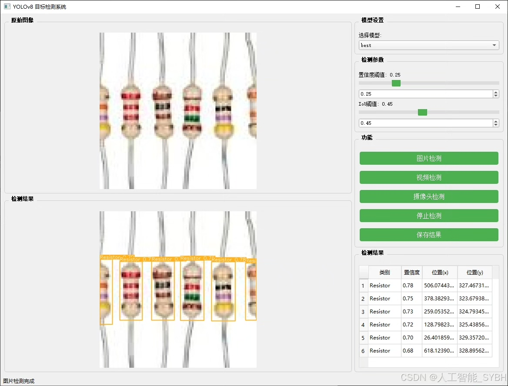
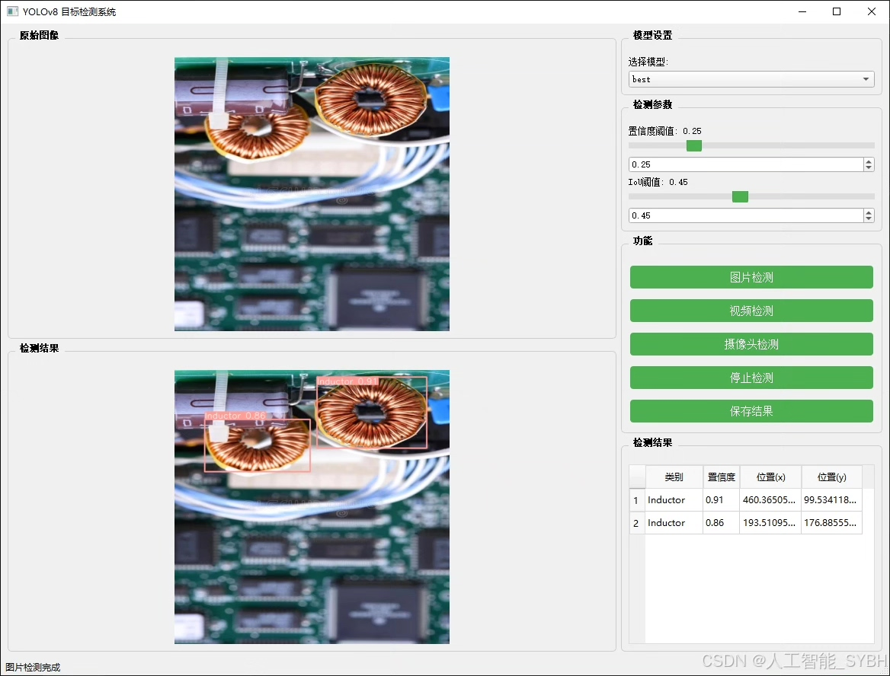
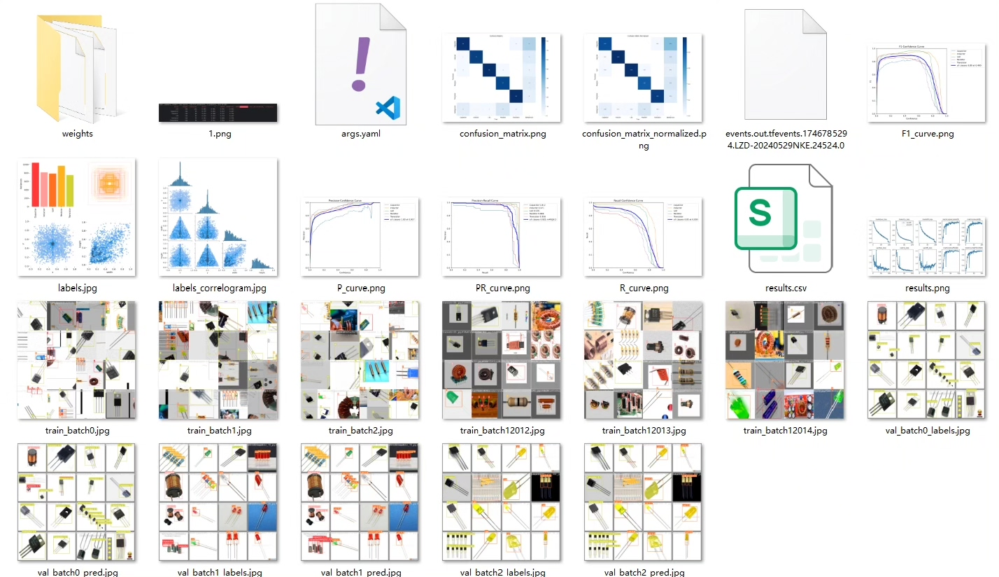
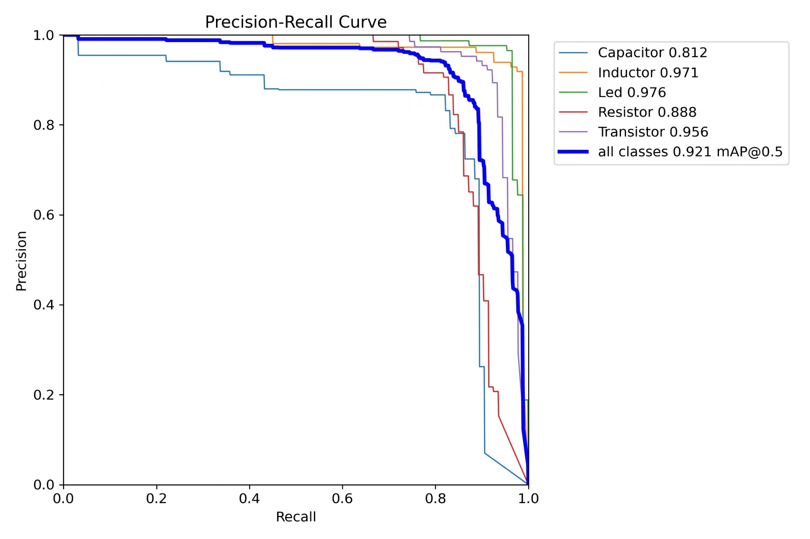
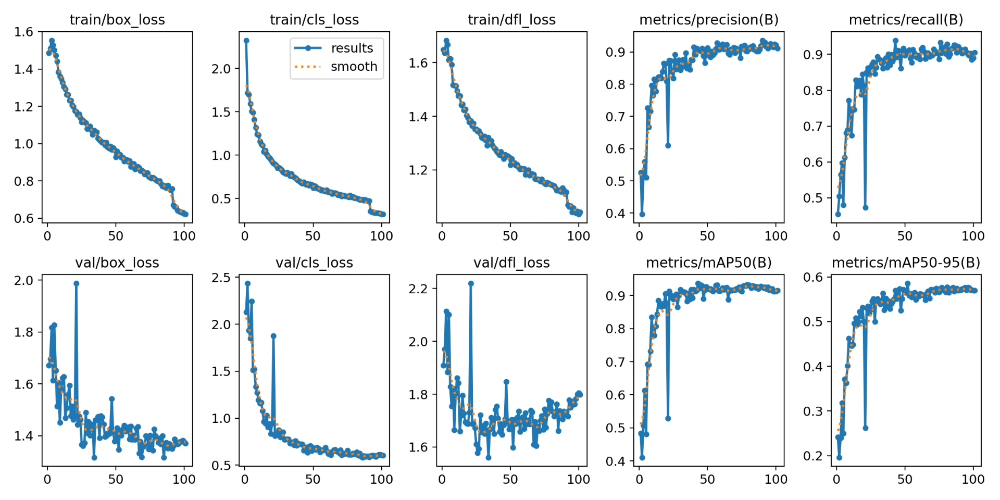
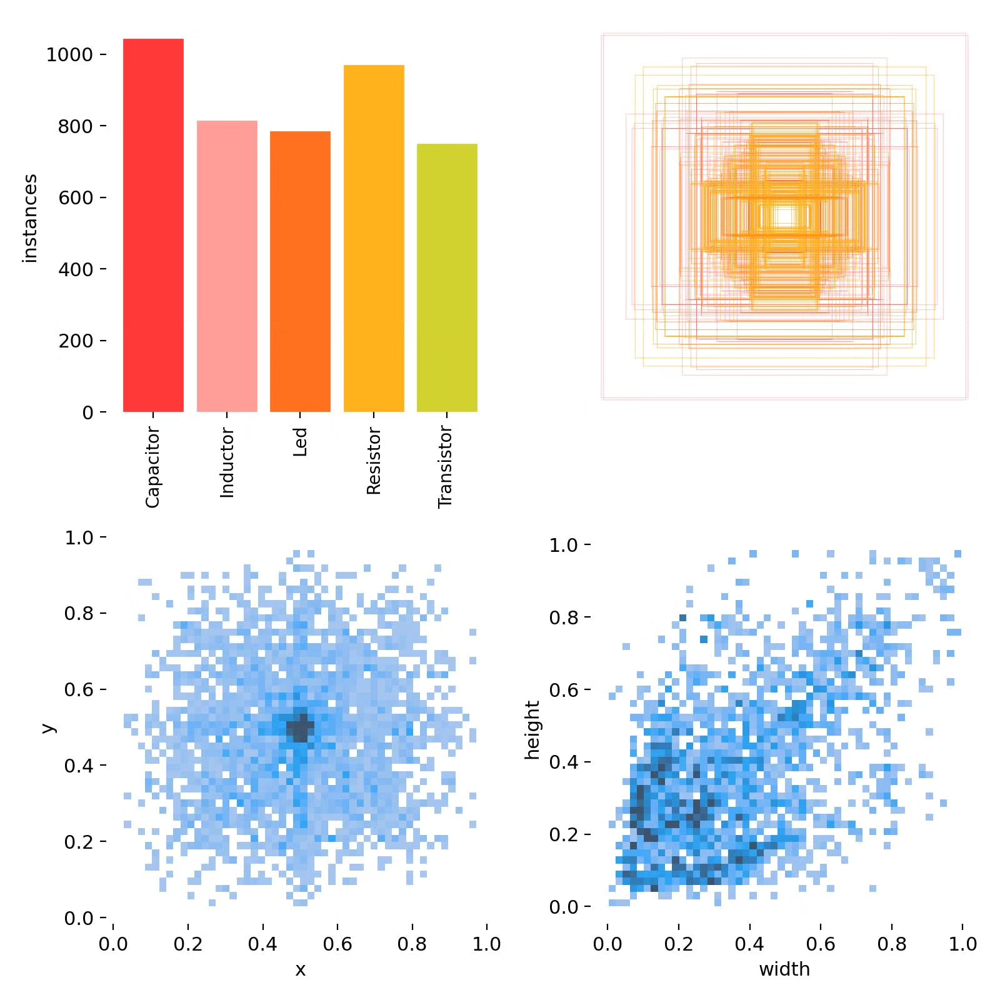
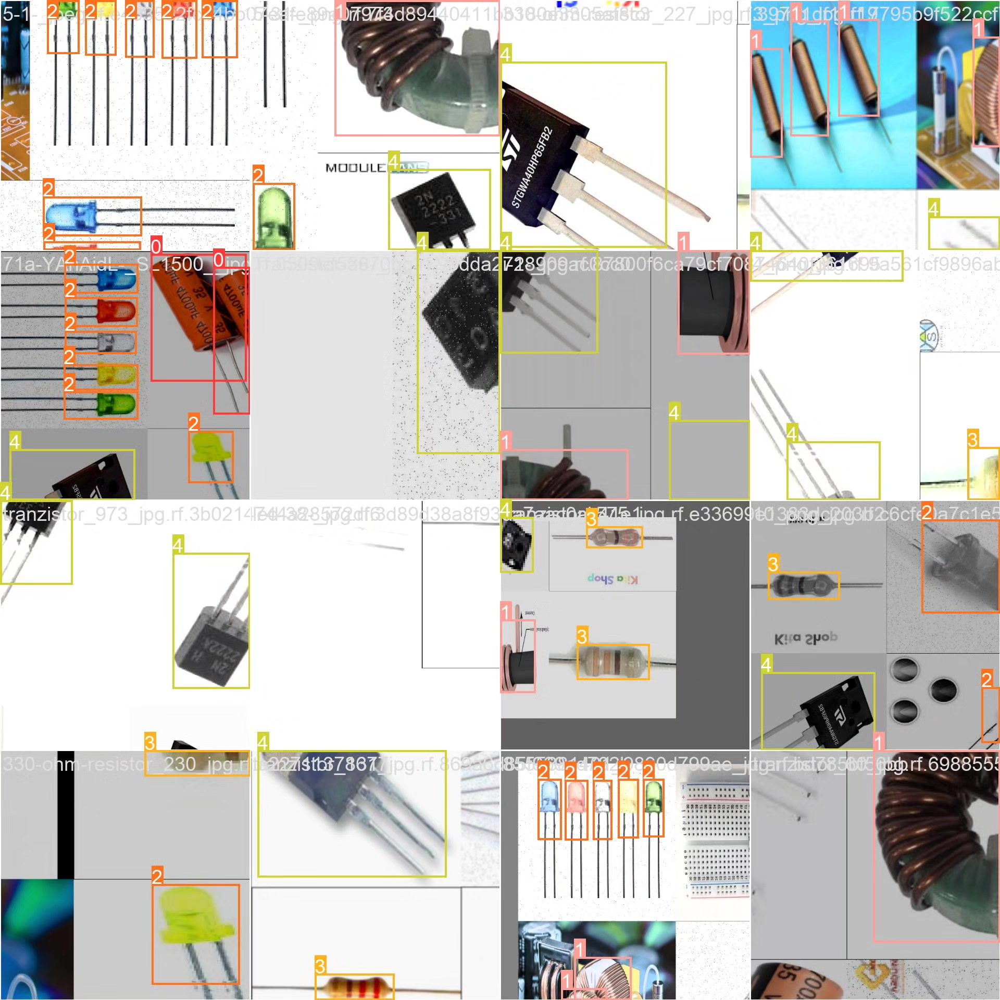
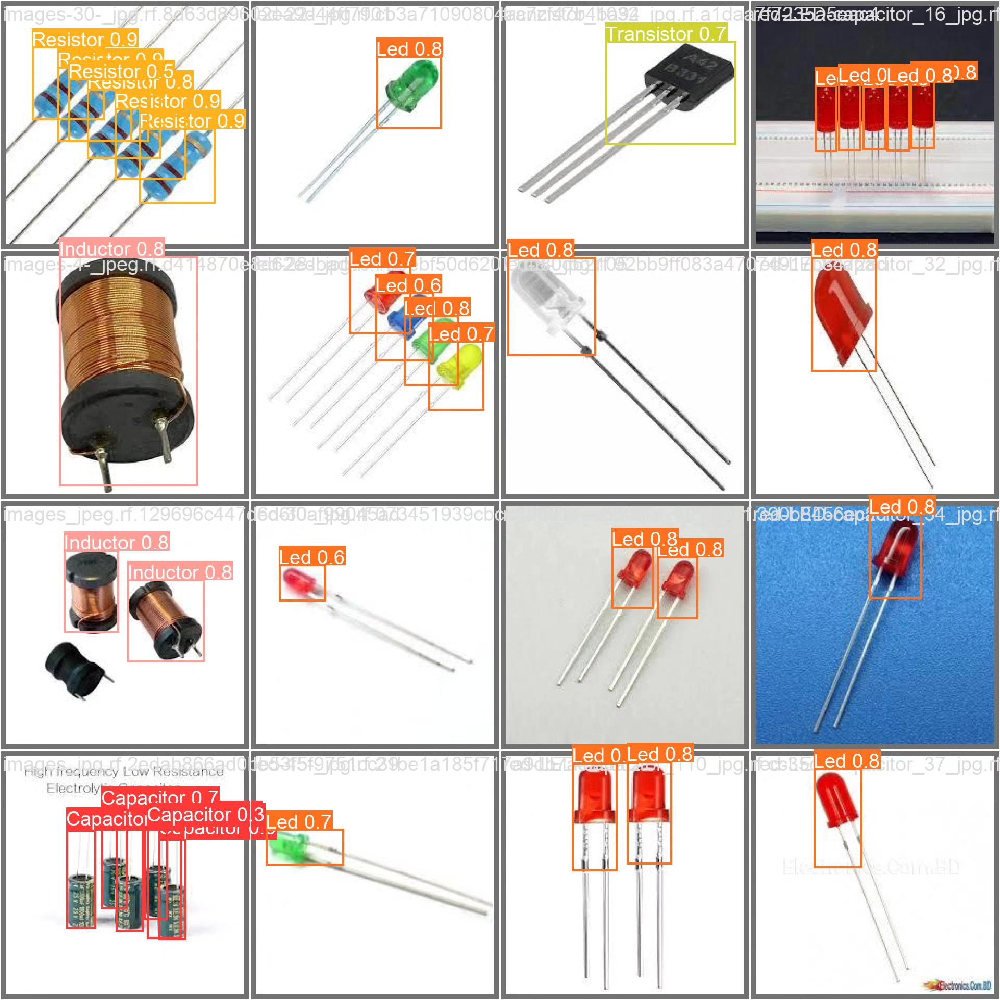

# YOLOv8-based deep learning system for electronic component target detection

## Body

This project is based on the YOLOv8 deep learning algorithm for target detection, developing a high-precision automatic recognition and classification system for electronic components. It can accurately detect and classify five common electronic components: capacitors (Capacitor), inductors (Inductor), LEDs (Led), resistors (Resistor), and transistors (Transistor). The system uses a five-classification (nc=5) detection model, trained and optimized on high-quality labeled datasets, including 2103 images in the training set, 226 in the validation set, and 97 in the test set, ensuring that the model has high generalization ability and robustness.

The company's products have obtained the official commercial license certification from YOLO.

We provide after-sales service.

After payment, we will provide WeChat ID to answer questions anytime.

Environment configuration: We will provide an environment configuration tutorial, and WeChat will provide answers.

Remote installation service: If you need remote configuration, an additional fee of 69 is required, with all fees refunded if the configuration fails (only refund installation fees for special old computers).

Retraining dataset: After setting up the environment, you can train on your own computer. If you need us to retrain, just pay 69 + computing power fees (2.5 yuan/hour).

Full after-sales service

## Images

## Payment

Here is a pay link on Stripe ( https://buy.stripe.com/3cs8yP7sY87d0vu9AB ). Please contact me lonlonago@foxmail.com after funding $89, and I will send you a complete data files , thank you!

